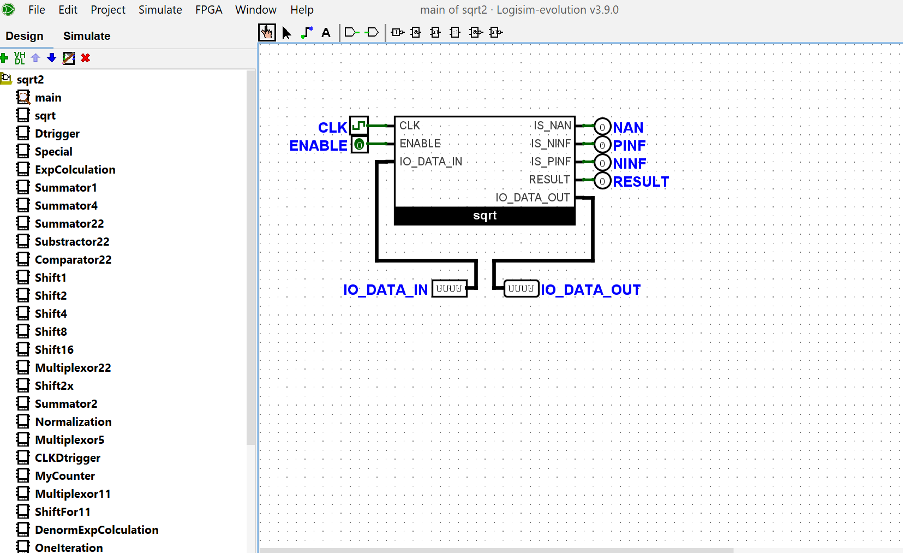

# Half-Precision Sqrt

Этот проект — реализация вычисления квадратного корня для чисел формата **half precision** (IEEE 754 binary16):

- сначала блок был спроектирован в **Logisim** на уровне логических элементов,
- затем перенесён в **Verilog** в виде модуля `sqrt2`,
- к модулю написан тестбенч `sqrt2_tb` и проверка через симулятор **Icarus Verilog**.

---

## Схема в Logisim

Чтобы запустить программу, необходимо скачать Logisim-evolution, и открыть файл `sqrt.circ`

Итоговая ручка вынесена в схему main, там можно задать и получить корень из него.

Весь код разделен на подсхемы, каждую из которых так же можно открыть и посмотреть




---

## Модуль `sqrt2` (Verilog)

Модуль `sqrt2` реализует квадратный корень для чисел формата **binary16** с поддержкой специальных значений:

- **NaN**,
- **+∞** и **−∞**,
- **нулей** (±0),
- **денормализованных чисел**.

Интерфейс:

```verilog
module sqrt2(
    inout   wire [15:0] IO_DATA,
    output  wire IS_NAN,
    output  wire IS_PINF,
    output  wire IS_NINF,
    output  wire RESULT,
    input   wire CLK,
    input   wire ENABLE
);
```


- `IO_DATA` — двунаправленная шина данных (как это и реализовано в реальных компьютерах, одна шина для I/O) (16 бит, формат IEEE 754 half).  
  В режиме приёма на неё подаётся исходное число, в режиме выдачи модуль кладёт результат (или спец. значение).
- `ENABLE` — разрешение работы модуля:
  - при `ENABLE = 0` внутреннее состояние сбрасывается,
  - при `ENABLE = 1` модуль считывает вход, вычисляет корень и выставляет `RESULT = 1` после завершения.
- `RESULT` — флаг готовности результата.
- `IS_NAN`, `IS_PINF`, `IS_NINF` — флаги, указывающие тип полученного значения.


Вычисление квадратного корня выполняется по итерационному алгоритму с формированием результата в мантиссе (`res_mant`) и корректировкой экспоненты. Используется 22-битное развернутое представление мантиссы (`mant22`) и поразрядный алгоритм извлечения квадратного корня.

---

## Тестбенч `sqrt2_tb`

Файл `sqrt2_tb.sv` подключает модуль `sqrt2` и генерирует тактовый сигнал, подавая на вход различные half-значения

Запуск теста:

1. На шину `IO_DATA` подаётся тестовое значение.
2. Сигнал `ENABLE` переводится в 1.
3. Через один такт вход отпускается в `Z` (Высокоимпедансное состояние - имитация двунаправленной шины).
4. Тест ожидает `RESULT` и затем проверяет `IO_DATA` на ожидаемый значения.


---

## Сборка и запуск через Icarus Verilog

### Сборка

```bash
iverilog -g2012 -o sqrt_tb sqrt2.sv sqrt2_tb.sv
```

Здесь:

- `-g2012` — включаем поддержку SystemVerilog-2012 (для `always #1` и синтаксиса `include`),
- `-o sqrt_tb` — имя выходного исполняемого файла симуляции,
- `sqrt2.sv` и `sqrt2_tb.sv` — исходники модуля и тестбенча.

### Запуск симуляции

```bash
vvp sqrt_tb
```

В выводе консоли будут строки с результатами тестов:

```text
Test 1 PASSED - sqrt(3C00) = 3C00
Test 2 PASSED - sqrt(4400) = 4000
Test 3 PASSED - sqrt(3400) = 3800
Test 4 PASSED - sqrt(2392) = 2FC8
```

При несовпадении результатов будут выведены соответствующие сообщения `FAILED`.

---
